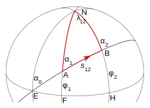

# geographiclib-go
### A Go port of [GeographicLib](https://geographiclib.sourceforge.io/)

# Description
This is a Go implementation of the geodesic algorithms from Charles F. F. Karney's [GeographicLib](https://geographiclib.sourceforge.io/). Though not an official implementation of GeographicLib, geographiclib-go has feature parity with the officially-maintained [Java](https://geographiclib.sourceforge.io/html/java/) and [Python](https://geographiclib.sourceforge.io/html/python/) implementations and additionally includes a utility to validate the implementation against the official 500k-line [GeodTest.dat](https://geographiclib.sourceforge.io/html/geodesic.html#testgeod) repository of geodesic test data.

More information about the GeographicLib project can be found at https://geographiclib.sourceforge.io. This README lifts heavily from GeographicLib's excellent project documentation, especially the section [Geodesics on an ellipsoid](#geodesics-on-an-ellipsoid), which copies Karney's documentation verbatim to introduce the direct and inverse geodesic problems.
           
# Contents
1. [Setup](#setup)
   1. [Installation](#installation)
   1. [Testing](#testing)
1. [Geodesics on an ellipsoid](#geodesics-on-an-ellipsoid)
   1. [Introduction](#introduction)
   1. [Additional properties](#additional-properties)
   1. [Multiple shortest geodesics](#multiple-shortest-geodesics)
   1. [Background](#background)
1. [The library interface](#the-library-interface)
   1. [Units](#units)
   1. [`geodesic.Data`](#geodesicdata)
   1. [`capabilities.Mask`](#capabilitiesmask)
   1. [Restrictions on the parameters](#restrictions-on-the-parameters)
1. [Examples](#examples)
   1. [Initializing](#initializing)
   1. [Basic geodesic calculations](#basic-geodesic-calculations)
   1. [Computing waypoints](#computing-waypoints)
   1. [Measuring areas](#measuring-areas)
1. [References](#references)

# Setup
## Installation
< TODO >

## Testing
< TODO >

# Geodesics on an ellipsoid
## Introduction
Consider a ellipsoid of revolution with equatorial radius , polar semi-axis , and flattening . Points on the surface of the ellipsoid are characterized by their latitude  and longitude . (Note that latitude here means the *geographical latitude*, the angle between the normal to the ellipsoid and the equatorial plane).

The shortest path between two points on the ellipsoid at  and  is called the *geodesic*. Its length is  and the geodesic from point 1 to point 2 has forward azimuths  and  at the two end points. In this figure, we have .



A geodesic can be extended indefinitely by requiring that any sufficiently small segment is a shortest path; geodesics are also the straightest curves on the surface.

Traditionally two geodesic problems are considered:

* the direct problem — given , , , , determine , , and ; this is solved by `Geodesic.Direct()`.
* the inverse problem — given , , , , determine , , and ; this is solved by `Geodesic.Inverse()`.

## Additional properties
The functions which solve the geodesic problems also calculate several other quantities of interest:

*  is the area between the geodesic from point 1 to point 2 and the equator; i.e., it is the area, measured counter-clockwise, of the quadrilateral with corners , , , and . It is given in meters.
* , the reduced length of the geodesic, is defined such that if the initial azimuth is perturbed by  (radians) then the second point is displaced by  in the direction perpendicular to the geodesic.  is given in meters. On a curved surface the reduced length obeys a symmetry relation, . On a flat surface, we have .
*  and  are geodesic scales. If two geodesics are parallel at point 1 and separated by a small distance , then they are separated by a distance  at point 2.  is defined similarly (with the geodesics being parallel to one another at point 2).  and  are dimensionless quantities. On a flat surface, we have .
*  is the arc length on the auxiliary sphere. This is a construct for converting the problem to one in spherical trigonometry. The spherical arc length from one equator crossing to the next is always 180°.

If points 1, 2, and 3 lie on a single geodesic, then the following addition rules hold:

* 
* 
* 
* 
* 
* 

## Multiple shortest geodesics
The shortest distance found by solving the inverse problem is (obviously) uniquely defined. However, in a few special cases there are multiple azimuths which yield the same shortest distance. Here is a catalog of those cases:

*  (with neither point at a pole). If , the geodesic is unique. Otherwise there are two geodesics and the second one is obtained by setting , , . (This occurs when the longitude difference is near  for oblate ellipsoids.)
*  (with neither point at a pole). If  or , the geodesic is unique. Otherwise there are two geodesics and the second one is obtained by setting , . (This occurs when  is near  for prolate ellipsoids.)
* Points 1 and 2 at opposite poles. There are infinitely many geodesics which can be generated by setting , for arbitrary . (For spheres, this prescription applies when points 1 and 2 are antipodal.)
*  (coincident points). There are infinitely many geodesics which can be generated by setting , for arbitrary .

## Background
The algorithms implemented by this package are given in Karney (2013) and are based on Bessel (1825) and Helmert (1880); the algorithm for areas is based on Danielsen (1989). These improve on the work of Vincenty (1975) in the following respects:

* The results are accurate to round-off for terrestrial ellipsoids (the error in the distance is less than 15 nanometers, compared to 0.1 mm for Vincenty).
* The solution of the inverse problem is always found. (Vincenty’s method fails to converge for nearly antipodal points.)
* The routines calculate differential and integral properties of a geodesic. This allows, for example, the area of a geodesic polygon to be computed.

# The library interface
## Units
All angles (latitude, longitude, azimuth, arc length) are measured in degrees with latitudes increasing northwards, longitudes increasing eastwards, and azimuths measured clockwise from north. For a point at a pole, the azimuth is defined by keeping the longitude fixed, writing , and taking the limit .

## `geodesic.Data`
The results returned by `Geodesic.Direct()`, `Geodesic.Inverse()`, `Line.Position()`, etc., return a struct type (`geodesic.Data`) with some of the following 12 fields set:

* `Lat1` = , latitude of point 1 (degrees)
* `Lon1` = , longitude of point 1 (degrees)
* `Azi1` = , azimuth of line at point 1 (degrees)
* `Lat2` = , latitude of point 2 (degrees)
* `Lon2` = , longitude of point 2 (degrees)
* `Azi2` = , (forward) azimuth of line at point 2 (degrees)
* `S12` = , distance from 1 to 2 (meters)
* `A12` = , arc length on auxiliary sphere from 1 to 2 (degrees)
* `M12Reduced` = , reduced length of geodesic (meters)
* `M12` = , geodesic scale at 2 relative to 1 (dimensionless)
* `M21` = , geodesic scale at 1 relative to 2 (dimensionless)
* `S12Area` = , area between geodesic and equator (meters)

**Note**: because of Go's use of capitalization to denote exported symbols, the names of a few of these fields do not exactly match their symbolic representations. For example, it is not possible to distinguish between  and  using lowercase vs. capitalized field names as is possible in other languages' implementations of GeographicLib;  *must* be capitalized to be accessible from other packages. Thus, where necessary to remove ambiguity, suffixes have been added to the less-commonly-used field names (e.g., `S12`, `S12Area`).

## `capabilities.Mask`
The standard geodesic functions (`Geodesic.Direct()`, `Geodesic.Inverse()`, etc.) all return the 7 basic quantities: `Lat1`, `Lon1`, `Azi1`, `Lat2`, `Lon2`, `Azi2`, `S12`, together with the arc length `A12`. However, each function has a counterpart `<Function>WithCapabilities()` requiring an additional parameter of type `capabilities.Mask`; this additional parameter is used to tailor which quantities to calculate. In addition, when a `Line` is instantiated, it too can be provided with a `capabilities.Mask` parameter specifying what quantities can be returned from the resulting instance.

A custom `capabilities.Mask` parameter can be created by bitwise-or(`|`)’ing together any of the following values:

* `None` = no capabilities, no output
* `Latitude` = compute latitude, `Lat2`
* `Longitude` = compute longitude, `Lon2`
* `Azimuth` = compute azimuths, `Azi1` and `Azi2`
* `Distance` = compute distance, `S12`
* `Standard` = all of the above
* `DistanceIn` = allow `S12` to be used as input in the direct problem
* `ReducedLength` = compute reduced length, `M12Reduced`
* `GeodesicScale` = compute geodesic scales, `M12` and `M21`
* `Area` = compute area, `S12Area`
* `All` = all of the above
* `LongUnroll` = unroll longitudes

`DistanceIn` is a capability provided when instantiating a `Line`. It allows the position on the line to specified in terms of distance. (Without this, the position can only be specified in terms of the arc length.)

`LongUnroll` controls the treatment of longitude. If it is not set then the `Lon1` and `Lon2` fields are both reduced to the range [-180°, 180°). If it is set, then `Lon1` is as given in the function call and (`Lon2` - `Lon1`) determines how many times and in what sense the geodesic has encircled the ellipsoid.

**Note**: The standard geodesic functions (`Geodesic.Direct()`, `Geodesic.Inverse()`, etc.) are exactly equivalent to calling their counterpart `<Function>WithCapabilities()` with an argument of  `Standard`. Note also that `A12` is always included in the result.

## Restrictions on the parameters
* Latitudes must lie in [-90°, 90°]. Latitudes outside this range are replaced by NaNs.
* The distance `S12` is unrestricted. This allows geodesics to wrap around the ellipsoid. Such geodesics are no longer shortest paths; however, they retain the property that they are the straightest curves on the surface.
* Similarly, the spherical arc length `A12` is unrestricted.
* Longitudes and azimuths are unrestricted; internally these are exactly reduced to the range [-180°, 180°), but see also the `LongUnroll` capability.
* The equatorial radius  and the polar semi-axis  must both be positive and finite (this implies that ).
* The flattening  should satisfy  in order to retain full accuracy. This condition holds for most applications in geodesy.

Reasonably accurate results can be obtained for . Here is a table of the approximate maximum error (expressed as a distance) for an ellipsoid with the same equatorial radius as the WGS84 ellipsoid and different values of the flattening.

|abs(f)|error|
|---|---|
|0.003|15 nm|
|0.01|25 nm|
|0.02|30 nm|
|0.05|10 μm|
|0.1|1.5 mm|
|0.2|300 mm|

Here 1 nm = 1 nanometer =  m (not 1 nautical mile!)

# Examples
## Initializing
The examples below assume that geographiclib-go has been imported using the package name `geodesic`.

geographiclib-go comes with a predefined instance of `Geodesic` for the WGS84 ellipsoid. To use this instance, simply reference `geodesic.WGS84`.
```go
g := geodesic.WGS84
```

You can determine the ellipsoid parameters with the `EquatorialRadius()` and `Flattening()` functions, for example,
```go
g := geodesic.WGS84
a := g.EquatorialRadius() // a = 6378137.0
fInv := 1.0 / g.Flattening() // fInv = 298.257223563
```

If you need to use a different ellipsoid, you can construct one with `NewGeodesic()`:
```go
g := NewGeodesic(6378388.0, 1.0/297.0) // the international ellipsoid
```

## Basic geodesic calculations
The distance from Wellington, NZ (41.32S, 174.81E) to Salamanca, Spain (40.96N, 5.50W) using `Inverse()`:
```go
r := geodesic.WGS84.Inverse(-41.32, 174.81, 40.96, -5.50)
fmt.Printf("The distance is %.3f m.\n", r.S12)
// Prints: "The distance is 19959679.267 m."
```

The point 20000 km SW of Perth, Australia (32.06S, 115.74E) using `Direct()`:
```go
r := geodesic.WGS84.Direct(-32.06, 115.74, 225, 20000e3)
fmt.Printf("The position is (%.8f, %.8f).\n", r.Lat2, r.Lon2)
// Prints: "The position is (32.11195529, -63.95925278)."
```

The area between the geodesic from JFK Airport (40.6N, 73.8W) to LHR Airport (51.6N, 0.5W) and the equator. This is an example of setting the output mask parameter.

```go
r := geodesic.WGS84.InverseWithCapabilities(40.6, -73.8, 51.6, -0.5, capabilities.Area)
fmt.Printf("The area is %.1f m^2.\n", r.S12Area)
// Prints: "The area is 40041368848742.5 m^2."
```

## Computing waypoints
Consider the geodesic between Beijing Airport (40.1N, 116.6E) and San Fransisco Airport (37.6N, 122.4W). Compute waypoints and azimuths at intervals of 1000 km using `Geodesic.InverseLine()` and `Line.PositionWithCapabilities()`:
```go
l := geodesic.WGS84.InverseLine(40.1, 116.6, 37.6, -122.4)
ds := 1000e3
n := int(math.Ceil(l.Distance() / ds))

for i := 0; i < n+1; i++ {
  if i == 0 {
      fmt.Println("distance latitude longitude azimuth")
  }
  s := math.Min(ds*float64(i), l.Distance())
  r := l.PositionWithCapabilities(s, capabilities.Standard|capabilities.LongUnroll)
  fmt.Printf("%.0f %.5f %.5f %.5f\n", r.S12, r.Lat2, r.Lon2, r.Azi2)
}
// Prints:
// 
// distance latitude longitude azimuth
// 0 40.10000 116.60000 42.91642
// 1000000 46.37321 125.44903 48.99365
// 2000000 51.78786 136.40751 57.29433
// 3000000 55.92437 149.93825 68.24573
// 4000000 58.27452 165.90776 81.68242
// 5000000 58.43499 183.03167 96.29014
// 6000000 56.37430 199.26948 109.99924
// 7000000 52.45769 213.17327 121.33210
// 8000000 47.19436 224.47209 129.98619
// 9000000 41.02145 233.58294 136.34359
// 9513998 37.60000 237.60000 138.89027
```

The use of `capabilities.LongUnroll` in the call to `Line.PositionWithCapabilities()` ensures that the longitude does not jump on crossing the international dateline.

If the purpose of computing the waypoints is to plot a smooth geodesic, then it’s not important that they be exactly equally spaced. In this case, it’s faster to parameterize the line in terms of the spherical arc length with `Line.ArcPositionWithCapabilities()`. Here the spacing is about 1° of arc which means that the distance between the waypoints will be about 60 NM.

```go
l := geodesic.WGS84.InverseLine(40.1, 116.6, 37.6, -122.4)
n := int(math.Ceil(l.Arc()))
da := l.Arc() / float64(n)

for i := 0; i < n+1; i++ {
  if i == 0 {
      fmt.Println("latitude longitude")
  }
  a := da * float64(i)
  r := l.ArcPositionWithCapabilities(a, capabilities.Latitude|capabilities.Longitude|capabilities.LongUnroll)
  fmt.Printf("%.5f %.5f\n", r.Lat2, r.Lon2)
}
// Prints:
// 
// latitude longitude
// 40.10000 116.60000
// 40.82573 117.49243
// 41.54435 118.40447
// 42.25551 119.33686
// 42.95886 120.29036
// 43.65403 121.26575
// 44.34062 122.26380
// ...
// 39.82385 235.05331
// 39.08884 235.91990
// 38.34746 236.76857
// 37.60000 237.60000
```

The variation in the distance between these waypoints is on the order of 1/f.

## Measuring areas
Measure the area of Antarctica using the `PolygonArea` type:

```go
p := geodesic.NewPolygonArea(geodesic.WGS84, false)
antarctica := [][]float64{
  {-63.1, -58}, {-72.9, -74}, {-71.9, -102}, {-74.9, -102}, {-74.3, -131},
  {-77.5, -163}, {-77.4, 163}, {-71.7, 172}, {-65.9, 140}, {-65.7, 113},
  {-66.6, 88}, {-66.9, 59}, {-69.8, 25}, {-70.0, -4}, {-71.0, -14},
  {-77.3, -33}, {-77.9, -46}, {-74.7, -61},
}

for _, pnt := range antarctica {
  p.AddPoint(pnt[0], pnt[1])
}
r := p.Compute(false, true)
fmt.Printf("Perimeter/area of Antarctica are %.3f m / %.1f m^2.\n", r.Perimeter, r.Area)
// Prints: "Perimeter/area of Antarctica are 16831067.893 m / 13662703680020.1 m^2."
```

# References
* F. W. Bessel, [The calculation of longitude and latitude from geodesic measurements (1825)](https://arxiv.org/abs/0908.1824), Astron. Nachr. 331(8), 852–861 (2010), translated by C. F. F. Karney and R. E. Deakin.
* F. R. Helmert, [Mathematical and Physical Theories of Higher Geodesy, Vol 1](https://doi.org/10.5281/zenodo.32050), (Teubner, Leipzig, 1880), Chaps. 5–7.
* T. Vincenty, [Direct and inverse solutions of geodesics on the ellipsoid with application of nested equations](http://www.ngs.noaa.gov/PUBS_LIB/inverse.pdf), Survey Review 23(176), 88–93 (1975).
* J. Danielsen, [The area under the geodesic](https://doi.org/10.1179/003962689791474267), Survey Review 30(232), 61–66 (1989).
* C. F. F. Karney, [Algorithms for geodesics](https://doi.org/10.1007/s00190-012-0578-z), J. Geodesy 87(1) 43–55 (2013); [addenda](https://geographiclib.sourceforge.io/geod-addenda.html).
* C. F. F. Karney, [Geodesics on an ellipsoid of revolution](https://arxiv.org/abs/1102.1215v1), Feb. 2011; [errata](https://geographiclib.sourceforge.io/geod-addenda.html#geod-errata).
* [A geodesic bibliography](https://geographiclib.sourceforge.io/geodesic-papers/biblio.html).
* The wikipedia page, [Geodesics on an ellipsoid](https://en.wikipedia.org/wiki/Geodesics_on_an_ellipsoid).
